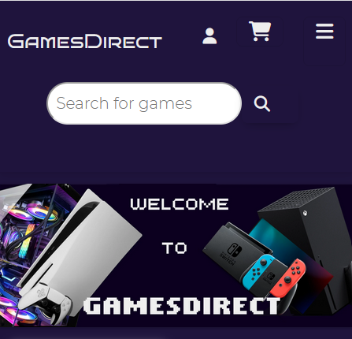

# Live Link
[https://www.gamesdirect.shop/store_pages/]((https://www.gamesdirect.shop/store_pages/))

# Alternate Link
[https://gamesdirect-244b07933989.herokuapp.com/](https://gamesdirect-244b07933989.herokuapp.com/)

## Table of Contents

- [App Goals](#app-goals)
- [Site Strategy](#site-strategy)
  * [Targeted Users](#targeted-users)
  * [Site Goals](#site-goals)
  * [Project Goals](#project-goals)
- [Development Methodology](#development-methodology)
  * [Initial Project Creation](#initial-project-creation)
  * [User Management](#user-management)
  * [Project Data](#project-data)
  * [Wishlists](#wishlists)
  * [Newsletter Subscriptions](#newsletter-subscriptions)
  * [Cart Functionality](#cart-functionality)
  * [Checkout Functionality](#checkout-functionality)
  * [Site Responsiveness](#site-responsiveness)
- [Design Visualization](#design-visualization)
  * [Wireframes](#wireframes)
  * [Database Construction](#database-construction)
- [Features](#features)
  * [Common Features](#common-features)
  * [Home Page](#home-page)
  * [Products Page/Search Results Page](#products-page-search-results)
  * [Game Description Page](#game-description-page)
  * [Orders Page](#orders-page)
  * [404 Page](#404-page)

- [Colour Palette](#colour-palette)
- [Typography](#typography)
- [Testing](#testing)
- [Deployment](#deployment)
  * [AWS](#aws)
  * [Heroku](#heroku)
- [Technologies Used](#technologies-used)
  * [Libraries & Frameworks](#libraries--frameworks)
  * [Resources](#resources)
- [Future Improvements](#future-improvements)
- [Acknowledgements](#acknowledgements)

## App Goals

GamesDirect is a primarily Django based project, part of the Code Institute Project Portfolio 5. The aim of this site is to allow users with an interest in gaming a storefront to purchase games from a number of the current most popular platforms. I have integrated this project with both Stripe and Mailchimp to enhance the e-commerce offerings available through the site via newsletters and allowing for direct purchases to be made through the storefront using Stripe Checkout.

### Site Strategy

#### Targeted Users

* Users with an interest in gaming

* Users who would be interested primarily in purchasing digital content in place of physical games

* Users who would be regularly returning to the site to check for new products/items on sale

#### Site Goals

* For users to be able to create an account for themselves

* For users to be able to create a wishlist for themselves to encourage return visits to the site

* To provide up to date information to users when they access the site

* To give users further information when not browsing the site via a site newsletter containing offers, updates, etc.

#### Project Goals

To provide a storefront to users providing digital download keys to gaming focused users. To encourage repeat interactions with the site, regular sales would be implemented which are clearly indicated to the user when viewing the products available on the site.

To implement full CRUD functionality which is accessible to standard users accessing the site normally in addition to superusers through the admin site

### Development Methodology

The project was developed using an Agile methodology with a number of Epics in place and the User Stories arising from them. These User Stories and Epics were kept track of in the Github Project Board found [here](https://github.com/users/fergalcob/projects/2). The following User Stories and Epics were expanded upon within the project board to encompass the tasks that would need to take place to accomplish them:

#### Initial Project Creation

* As a developer I need to be able to set up and create a new Django app before continuing
* As a developer I need to have a Minimum Viable Product to continue development
* As a developer I need to be able to set up and create a new Django app before continuing

#### User Management

* As a user I want to be able to create an account via the site
* As a user I want to be able to log in to the website
* As a user I want my email address to be verifiable for additional security
* As a user I want to be able to reset/change my password
* As a user I want to be able to change my email address if necessary

#### Project Data

* As a developer I want to have specific models in place to hold data for use in project
* As a developer I want to have a dataset for use by users to the site
* As a user I want to be able to find games released on a specific platform
* As a user I want to be able to search for specific products on the site
* As a user I want to be able to search and filter within the products displayed
* As a user I want to be able to view additional information regarding specific products

#### Wishlists

* As a developer I need to be able to store user wishlists for future visibility
* As a user I want to be able to view my wishlist at any time
* As a user I want to be able to add items to my wishlist when browsing the site
* As a user I want to be able to remove items from my wishlist when browsing the site

#### Newsletter Subscriptions

* As a developer I need to set up a Mailchimp account for Marketing API functionality to be used
* As a user I want to be able to sign up for a newsletter through the site

#### Cart Functionality

* As a developer I need to be able to store the items that are added to a users cart
* As a user I want to be able to add items to my cart when browsing the site
* As a user I want to be able to update the quantity of items for a specific product in my cart
* As a user I want to be able to remove items from my cart directly

#### Checkout Functionality

* As a developer I want to have a payment processor in place to handle checkout
* As a user I want to be able to pay for items added to my cart
* As a user I want to be able to know the status of the payment made via Stripe
* As a user I want to be notified of my payment status via email if there are any delays in the payment flow

#### Site Responsiveness

* As a user I will be using the site on a phone and would like it to be easy to use
* As a developer I need to ensure the site is responsive to resolution changes
* As a developer I need to make sure that the content served is appropriate devices

### Design Visualization

#### Wireframes

These wireframes showing the initial concepts for the layout of the site were created using Balsamiq, some of the content structure has changed since their original design but the concepts have remained largely the same.

  
Index Page - Desktop

  
  
  

  
Index Page - Mobile

  
  
  

  
Index Page w/ Cart - Desktop

  
  
  

  
Index Page w/ Cart - Mobile

  
  
  

  
Products Page - Desktop

  
  
  

  
Products Page - Mobile

  
  
  

  
Product Page - Desktop

  
  
  

  
Product Page - Mobile

  
  
  

  
Orders Page - Desktop

  
  
  

  
Orders Page - Mobile

  
  
  

  
Profile Change Page - Desktop

  
  
  

  
Profile Change Page - Mobile

  
  
  

#### Database Construction

Graphviz was used to create the following image showing the database structure and the relationships between the created models.

## Features

### Common Features

#### Navbar

  
Navbar Mobile Closed & Expanded

  
  
  

All pages display a fixed navbar that changes style based on the device in use. This navbar is separated into three rows, the first contains the site name as logo on the left and on the right we have the user options and cart display button. The second contains the search bar for the site, splitting this into its own row allows for more space to be used for the search field and to draw the users eye. The third row then contains the platform links to bring users to the chosen products pages. This row when viewed on mobile is converted into a hamburger style expanding menu which is added next to the cart icon in the top row of the navbar.

#### Footer

  
Footer Mobile

  
  
  

We display the footer section at present across all pages of the site. In the desktop view, this section is broken down into a three column view. In the first, we have a sign up form which allows users to sign up for the site newsletter via Mailchimp. By entering their email address, users will be sent a verification email to confirm their opting in. In the second column, we have the links to our social media platforms and in the third column we have our contact methods for the site which will allow users to reach out if needed. When viewed on mobile, this view switches to a single column layout with our sections descending in the same order as outlined in the desktop view.

#### Cart

  
Cart Mobile

  
  
  

I have added the cart as an offcanvas element which is accessible across all pages of the site. This cart updates dynamically via jQuery with items being added as the user browses the site. Via the cart they can update the quantity of individual items being purchased as the stock for the product allows. If removing items from the cart, if the quantity reaches zero the item will be fully removed from the cart. There is also a bin icon which allows for immediate deletion of the product from the cart. If a user attempts to add more than the stock allows the quantity will be limited at the amount of stock. Also within the cart, we have a dynamically adjusting total and a checkout button for creation of a Stripe checkout session. This component does not change between mobile and desktop, albeit with the cart covering roughly 33% of the page on the desktop and ~90% on mobile with a close button in place for mobile users.

### Home Page
 
  

When users first access the site through the home page, they will be presented with the banner image for the site. This banner was created with the site in mind, displaying the site name and containing images of the four gaming platforms that are targeted for sales on the site.

  
Home Page Body Mobile

  
  
  

The index page is broken down into several sections: On Sale, New Release & Top Rated items. These items are truncated displays showing 8 items per category with 4 per row on larger displays switching to a two column layout on mobile. The product displays show the name and platform release of the item along with a notification of the current stock levels, when an item has no keys in stock the stock will show as Out of Stock and the Add to Cart button will be disabled. When an item has between 1 to 5 keys, there will be an indicator of low stock and the current number remaining. Above 5 keys will simply show as In Stock. Along with this, if an item is on sale, the percentage sale value will be shown in the cover image with the original price and sale price being shown in the card body content for the item.

As seen in the mobile screenshot, when hovering over the cover image for the item, the user will be presented with an Add to Wishlist button or if already present a Remove From Wishlist icon. Along with this, they will also be shown and Add To Cart button if in stock or disabled Out of Stock button if applicable. This button when used will dynamically add the product to the Cart and will be shown via the dynamic side cart.

### Products Page/Search Results Page

  
Products Page Mobile

  
  
  

The products page has a similar layout to the home page with a 4 column desktop and two column mobile view. To avoid excessive page length, these product pages have been divided into 16 item pages to allow them to display evenly across multiple pages. In addition to the product display the product pages also include some basic sort and filter functionality. The sort button allows users to sort by release date, alphabetically and from the aggregated review scores in ascending or descending orders. THe filter option then allows users to filter the items by genre allowing them to see all items of a particular chosen genre only.

### Game Description Page

  
Game Description Mobile - Top

  
  
  

  
Game Description Mobile - Bottom

  
  
  

This page uses a split column layout which switches to a singular column when viewed on mobile. The top half containing any videos and screenshots for the selected game arranged via a carousel allowing the user to see more about the game. The second half then shows a partial cover image along with the price and stock levels. Users can also choose to add the item to the cart directly from this page also.

The second half of the page is then broken into a Details section which gives a game summary and then an informational column showing release date, genres & production companys involved in the items development and release. These informational sections can also be used as filter links if desired by the user.

### Orders Page

  
My Profile Mobile

  
  
  

The orders page allows users to see any completed or pending orders on the account. By using Stripe webhooks the order status is updated automatically. These orders are then separated into accordion elements to minimize page length. When expanded the order will show the items and quantities that were in the account at the time of payment. If a payment has been completed, there will be an additional set of buttons to expand the activation key details for each purchased product. After the webhook has received a successful payment signal, in addition to updating the order, the stock level for the purchased items will also be updated automatically to prevent excess purchases.

#### 404 Page

A simple 404 page has been created for the site notifying users that the page they have requested cannot be found and provides them a direct link to the homepage via the error message or via the standard navbar controls.

### Colour Palette

For this project I've gone with a very simple color scheme throughout the site using #1F143D for the general body background with #0C0020 for any content sections. The contrast of #0C0020 against #1F143D gives a sense of elevation to the page and also to create a sense of space in the page sections and divide items accordingly. For the text, I've chosen to use #eeeeee as it's off-white nature keeps the text being clearly legible while also being easier on the eyes when viewing the site for a longer period of time.

### Typography

For the Navbar and section headers I've chosen to use Bruno Ace SC as a semi-futuristic style of font in keeping with the gaming theme of the website. For the banner image on the homepage I've chosen to use PF Tempesta Five as a throwback font to keep in with the gaming theme but to evoke the early blocky nature of text in games. For the general page text, I've chosen to use Montserrat as it presents a clean and easy to read font which we want in place for the majority portion of the site text.

## E-Commerce Solutions

This project is focused on being tailored to a B2C solution. In the past several years, the gaming space has switched to a more digital delivery focused platform, based on this the decision was made to focus on the site for the delivery of digital activation keys cutting down physical products being delivered. In this way we can deliver items to customers in a faster manner and feedback on issues is no longer reliant on delivery delays as it is an entirely digital product. As part of this, in order to increase the user base a number of additional solutions have been incorporated to extend this reach.

### Mailchimp Newsletter

  
Newsletter Sign-Up - Site

  
  
  

  
Newsletter Sign-Up - Confirmation Email

  
  
  

Within the footer of the site, a sign-up form has been incorporated allowing users to provide their email address in order to sign-up for the site's newsletter. A message is displayed on successful submission of the email address and a verification email is sent to the provided email address for confirmation. By making this a double opt-in newsletter this helps cut down on any spam submissions and improving the reliability of the mailing list. The intention with the mailing list would be to include any details of new releases and new sales that have been started on the site in order to draw in recurring users.

### Facebook Business Page 

Above you can see a mock-up of a potential Facebook Business page for the storefront. The intention with the page would be to communicate upcoming releases and to promote sales on the site itself. It could also be used to directly communicate with users regarding stock queries/upcoming releases, with the footer of the main site also containing links to the store's Youtube and Twitch channels, new video and livestreaming content could also be addressed through this platform due to the immediacy of it as compared to the newsletter.

### SEO

Within the site itself, we have a sitemap.xml and robots.txt file in place for any search engines to index the site accordingly. In addition to this, the non-account pages also have a meta description with pages such as the individual game pages embedding the summary that users can see if accessing the full site. Other pages would have their descriptions tailored to the content displayed and to entice users to visit when ranked in the search results. A set of meta tags has also been added to each page with a focus on gaming and the digital distribution nature of the storefront. Each page has also some tailored meta tags to address the pages content such as product pages having the name of the item being sold on it included.

## Testing

The results of all testing performed can be found in the TESTING.md file [here](TESTING.md)

## Deployment

### AWS

#### S3(For Media/Static File Storage)

* As we are using AWS for this project for our media/static files and also for the database, we first need to sign in to our AWS account or sign up if you don't have one which can be done [here](https://portal.aws.amazon.com/billing/signup#/start/email)

* Once logged in, we will also need to create a user in order to give the necessary access permissions for performing tasks which will need to be done in the Identity and Access Management console. They will need to be assigned to a group containing the AmazonS3FullAccess permissions so that they can read and write to the bucket.

* Once the user is created and permissions, access keys will need to be generated for them which can be done from their user page in the IAM console

* Within the S3 console, a new bucket will need to be created with the Block Public Access settings disabled to ensure connectivity

* Once created, it may then be necessary to add additional permissions to the bucket as in the following example:

AWS S3 Bucket Permissions

{
    "Version": "2012-10-17",
    "Id": "Policy1488494182833",
    "Statement": [
        {
            "Sid": "Statement1",
            "Effect": "Allow",
            "Principal": {
                "AWS": "*"
            },
            "Action": [
                "s3:ListBucket",
                "s3:ListBucketVersions",
                "s3:GetBucketLocation",
                "s3:Get*",
                "s3:Put*",
                "s3:DeleteObject"
            ],
            "Resource": [
                "arn:aws:s3:::example-bucket",
                "arn:aws:s3:::example-bucket/*"
            ]
        }
    ]
}

* Once this has been created, we can take the Access Keys and the bucket URL and set these variables within our project

#### AWS RDS(For Database Management)

* Within AWS, we can also create a database from the RDS console

* Here we choose the type of database(PostgreSQL in this case) and set it up with an admin user and password and also ensure that public access is enabled

* With this done and the database created, we can take the URL and admin details to add to the project

### Heroku

* After signing in to the Heroku Dashboard, choose to create a new app

* Give the new app an available name and choose the appropriate location for the app

* After the creation of the app, in the Deploy tab choose to deploy from Github and connect to your GitHub account if necessary

* In the "Connect to Github" section search for the name of the app you are deploying and choose to connect from the search results

* Before deploying the app, the config variables need to be set up in the Settings tab

* For this project, due to the use of AWS for serving media/static files and also for hosting the database, we need to configure the following vars: AWS_ACCESS_KEY_ID, AWS_DEFAULT_ACL, AWS_SECRET_ACCESS_KEY, AWS_STORAGE_BUCKET_NAME, DATABASE_URL, USE_S3, MAILCHIMP_API_KEY, MAILCHIMP_TRANSACTIONAL_API, STRIPE_PUBLISHABLE_KEY & STRIPE_SECRET_KEY to ensure all keys are secure

* Optionally, while still in development DISABLE_COLLECTSTATIC can be set to 1 temporarily to prevent static files from being collected on deployment. When hosting on AWS, it can take some time for this to complete and so this option is not needed on all deployments but be sure to remove or set to 0 when doing the final deployment

* Once this is done, return to the Deploy tab and use the option to Enable Automatic Deployments or manually deploy the chosen project

* Once the deployment is complete, the Open App option can be used to bring you straight to the URL for the site

#### AWS RDS(For Database Management)

* Within AWS, we can also create a database from the RDS console

* Here we choose the type of database(PostgreSQL in this case) and set it up with an admin user and password and also ensure that public access is enabled

* With this done and the database created, we can take the URL and admin details to add to the project

## Technologies Used

[Python](https://www.python.org/) - Main language used in the project for all aspects

[Django](https://www.djangoproject.com/) - Python framework used for developing the application

[HTML](https://en.wikipedia.org/wiki/HTML) - Used for designing all the page content

[CSS](https://en.wikipedia.org/wiki/CSS) - Used for styling content displayed to end users

[Javascript](https://www.javascript.com/) - Used for some of the interactive content and formatting of certain pages

[AWS](https://aws.amazon.com/) - Used for hosting the media & static files and also for hosting the PostgreSQL database. Also used for Cloudfront deployment of site via CNAME alias

[PostgreSQL](https://www.postgresql.org/) - Used for the model databases

[Diagrams.net](https://www.diagrams.net/) - Used to design the flowchart in the README file

[Heroku](https://www.heroku.com/) - For deploying the finished code

[Gunicorn](https://gunicorn.org/) - Python based HTTP server used in deployment of final code

[Visual Studio Code](https://code.visualstudio.com/) - Used as the IDE in the development of the project

[Github](https://github.com/) - Used for hosting finished code for deployment

[Mailchimp](https://mailchimp.com/) - Used the Marketing and Transactional APIs for handling newsletter and order update emails

[Stripe](https://stripe.com/] - Used for handling the checkout functionality of the site

[GoDaddy](https://godaddy.com/) - DNS provider for the domain gamesdirect.shop

### Libraries & Frameworks

[Bootstrap](https://getbootstrap.com/) - Used for quicker styling of certain elements

[jQuery](https://jquery.com/) - Used for running certain Javascript content to handle cart and wishlist functionality

[Boto3](https://boto3.amazonaws.com/v1/documentation/api/latest/guide/quickstart.html) - Used to integrate AWS S3 bucket for content upload and retrieval

[Pillow](https://pillow.readthedocs.io/en/stable/) - Python image library used for conversion and assignment of image files

[Psycopg2](https://pypi.org/project/psycopg2/) - Python database connector used to connect with PostgreSQL database

[Django Resized](https://pypi.org/project/django-resized/) - Used to resize images for saving to S3 bucket

[SplideJS](https://splidejs.com/) - Used to form the multi-row carousel for use in the individual product pages

### Resources

[Graphviz](https://graphviz.org/) - Used to create the representation of the database structure and its relationships

[Balsamiq](https://balsamiq.cloud/) - Used to create the wireframes made for the outline of the site

[IGDB](https://www.igdb.com/) - API used to retrieve content for initial population of project

[MDN](https://developer.mozilla.org/en-US/docs/Learn/Server-side/Django) - Used as tutorial on Django set upload

[CDNFonts](https://www.cdnfonts.com/) - Used for the custom fonts used in the project

[W3Schools](https://www.w3schools.com/python/default.asp) - General documentation on Python syntax

[PyPI](https://pypi.org/) - Used for finding specific Python/Django libraries to meet the project needs

[Django Project Documentation](https://docs.djangoproject.com/en/4.2/) - Useful for clarification on certain aspects of Django commands

[GIMP](https://www.gimp.org/) - Used to create the banner seen on the home page

## Future Improvements

* Currently the site only supports direct user registration, in future I would like to add social account signups to handle OAuth logins via Gmail, Facebook etc.

## Acknowledgements

The guides [here](https://testdriven.io/blog/django-stripe-tutorial/) and [here](https://testdriven.io/blog/django-mailchimp/) at Testdriven were extremely useful in stepping through the process of setting up both the Stripe and Mailchimp integrations for use in the order handling process of the application.

The guide at [RealPython](https://realpython.com/move-django-model/) helped in the process of moving the existing models between apps without the loss of existing data

Thanks as well to [Stack Overflow](https://stackoverflow.com/) for their extensive knowledge on the causes of Python errors and the solutions to them.
