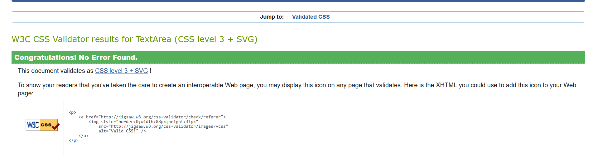

 - [Manual Testing](#manual-testing)
  * [Initial Project Creation](#initial-project-creation)
  * [User Management](#user-management)
  * [Project Data](#project-data)
  * [Wishlists](#wishlists)
  * [Newsletter Subscriptions](#newsletter-subscriptions)
  * [Cart Functionality](#cart-functionality)
  * [Checkout Functionality](#checkout-functionality)
 - [Code Validation](#code-validation)
   * [W3C Validation](#w3c-validation)
   * [CSS Validation](#css-validation)
   * [PEP8 Testing](#pep8-testing)
   * [Lighthouse Testing](#lighthouse-testing)
- [Devices Tested](#devices-tested)
- [Bugs & Known Issues](#bugs--known-issues)
- [Additional Updates](#additional-updates)
    
 

## Manual Testing

A large amount of manual testing was performed to ensure that user's did not experience any unintended consequences when browsing the site. The testing has been broken down by the Epics and User Stories based on the actions that could be performed in relation to the functions created and the expected results.

### Initial Project Creation

Feature Tested | Expected Result | Actual Result | Pass/Fail
---------------|-----------------|---------------|----------
Initial Django app created and reachable when started | Server returns successful result when requested | As Expected | Pass
Base Template is created and reachable via server address | Base template is returned when accessing URL for project | As Expected | Pass

### User Management

Feature Tested | Expected Result | Actual Result | Pass/Fail
---------------|-----------------|---------------|----------
User Creation | User is able to successfully create a user from registration page | As Expected | Pass
Email Verification | Email is sent to user after registering and link contained within verifies email address in DB | As Expected | Pass
User Sign-In | User is able to successfully log in using the credentials they provided on sign-up | As Expected | Pass
Display Content | After log in, content changes to reflect the change in user status | As Expected | Pass
Password Reset Email | When using password reset option, email is sent to address provided by user | As Expected | Pass
Password Reset Change | Using the link from the password reset email allows user to correctly change password | As Expected | Pass
Password Change Success | When using the password change form, on success they are returned to original page and notified of change in password | As Expected | Pass
Password Change Failure | If incorrect details are passed in password change form, users are returned to form page and notified of errors | As Expected | Pass
Email Change | When user enters new email address a verification email is triggered and sent to new email address | As Expected | Pass
Email Change Success | User's primary email address is not changed until verification email link is accessed | As Expected | Pass
Resend Verification | If user chooses to resend the verification email, a new email is triggered and sent to the correct email address | As Expected | Pass

### Project Data

Feature Tested | Expected Result | Actual Result | Pass/Fail
---------------|-----------------|---------------|----------
Data Models | Initial Game Models are migrated to DB | As Expected | Pass
Data Relationships | Game Models are correctly associating with their associated attributes(e.g. Covers, Screenshots) | As Expected | Pass
Platform Selection | When user selects a platform to view, only items for that chosen platform are shown | As Expected | Pass
Search Results | When searching for products, search query is performed without case-sensitivity allowing for accurate results | As Expected | Pass
Sort Options | When a user selects a sort to be used when viewing products, the sort displays correctly as chosen by the user | As Expected | Pass
Prevent Multiple Sorts | If a user has a sort in place, choosing a different sort option overrides the previous choice | As Expected | Pass
Filter Choice | If a user chooses a filter to put in place, the correct items for the filter are displayed | As Expected | Pass

### Wishlists

Feature Tested | Expected Result | Actual Result | Pass/Fail
---------------|-----------------|---------------|----------
Wishlist Creation| A wishlist is created for the logged in user when an item is first added to their wishlist | As Expected | Pass
Wishlist - Logged Out | A user is prompted to log in if they attempt to add an item to their wishlist when logged out | As Expected | Pass
Wishlist - Addition | When a user clicks the Add To Wishlist icon, the item selected is correctly added | As Expected | Pass
Wishlist - Addition Update | After a user adds an item to their wishlist, the icon changes to the removal icon | As Expected | Pass
Wishlist - Display Items | On load of a page, the correct icon is displayed depending on whether an item is already in the user's wishlist | As Expected | Pass
Wishlist - Page | User can access their wishlist page where all currently listed items are displayed | As Expected | Pass

### Newsletter Subscriptions

Feature Tested | Expected Result | Actual Result | Pass/Fail
---------------|-----------------|---------------|----------
Mailchimp Marketing API | Mailchimp is successfully reachable from project once API keys and connection view is created | As Expected | Pass
Newsletter Form | User is shown a newsletter form in the footer of the site on all pages | As Expected | Pass
Newsletter Sign-Up | User is able to provide their email address and receives confirmation email once submitted | As Expected | Pass

### Cart Functionality

Feature Tested | Expected Result | Actual Result | Pass/Fail
---------------|-----------------|---------------|----------
Cart Model | After migration, cart model is successfully retrievable | As Expected | Pass
Add To Cart | When user clicks Add To Cart button, item is successfully added to cart and viewable via the side cart | As Expected | Pass
Add To Cart - Updates | If a user clicks Add To Cart on item already in cart, quantity is updated by 1 based on Stock Availability | As Expected | Pass
Cart Update | If a user clicks the increment or decrement buttons in side cart the item successfully updates dynamically based on stock | As Expected | Pass
Cart Update - Removal | If a user clicks on decrement quantity and item reaches 0, item is removed from cart | As Expected | Pass
Cart - Delete | If a user clicks on the bin icon in side cart, item is immediately removed regardless of item quantity | As Expected | Pass

### Checkout Functionality

Feature Tested | Expected Result | Actual Result | Pass/Fail
---------------|-----------------|---------------|----------
Stripe Checkout Integration | Stripe Checkout Connection successful after adding API keys and connection view | As Expected | Pass
Checkout Button | When user clicks on checkout button they are brought to Stripe Checkout for payment with correct payment totals | As Expected | Pass
Payment Completion | On completion of payment, user is returned to their orders page | As Expected | Pass
Webhook Integration | Stripe webhook is added and successfully returns status of payment within project | As Expected | Pass
Email Notification | When webhook receives payment notification, an email is triggered to the users email address notifying them of order status | As Expected | Pass
Site Notification | Status of order is updated on orders page after receipt of webhook signal | As Expected | Pass
Payment Type - Delayed Success | Order is confirmed after using delayed payment method | Unable to test with Stripe test payments options, hook has been tied in to async success however | Unknown
Payment Type - Delayed Failure | Order is confirmed after using delayed payment method | Unable to test with Stripe test payments options, hook has been tied in to async failure | Unknown

### Orders

Feature Tested | Expected Result | Actual Result | Pass/Fail
---------------|-----------------|---------------|----------
Payment Sucess | On payment success, keys should be retrieved from purchased items based on quantity purchased | As Expected | Pass
Stock Updates | Keys added to successful orders are removed from original items to prevent duplicates being provided | As Expected | Pass
Out Of Stock | Games displayed on site disable purchase button when no keys are in stock | As Expected | Pass
Low Stock | If a product has 5 or less keys in stock, a message is displayed on the product page and all other game pages | As Expected | Pass

### Misc
Feature Tested | Expected Result | Actual Result | Pass/Fail
---------------|-----------------|---------------|----------
404 Page | When user accesses invalid URL, they are redirected to the 404 page | Partial Success | See Known Issues for further details
Cloudfront Deployment | User is able to reach heroku app via Cloudfront URL | As expected | Pass
Cloudfront Traffic | All necessary cookies and headers are being passed correctly to prevent CSRF errors | As expected | Pass
Alias Domain | After attachment to Cloudfront deployment ensure that the site can correctly be reached through gamesdirect.shop URL | As Expected | Pass

## Validation

### W3C Validation

All pages were run through the W3C validator to ensure there were no major issues.

  
Index Validation

  
  
  

  
Platforms Page Validation

  
  
  

  
Change Details Page Validation

  
  
  

  
Registration Page Validation

  
  
  

The one error on the pages above is due to the subscription sign-up form and the email change form from AllAuth both using the same id_email ID which would also occur with the forgotten password page due to the email address requirement

  
Product Page Validation

  
  
  

The error regarding the src attribute missing from the Youtube embeds on the Product Page can be attributed to the guide [here](https://isotropic.co/how-to-defer-parsing-of-javascript-for-youtube-embeds/). In order to reduce the blocking time that the embed cause when there are a large number of videos, the guide uses a Javascript function to defer the initial loading of the videos to improve initial page load times

  
Wishlist Page Validation

  
  
  

  
Orders Page Validation

  
  
  

  
Sign In Page Validation

  
  
  

  
404 Page Validation

  
  
  

### CSS Validation

The CSS was run through the W3C CSS validator to ensure no errors were found and the results are as follows

  
CSS Validation

  
  
  

### PEP8 Testing

Code for Checkout and Store Pages views were run through CI's PEP8 tester to ensure Python standards were met.

  
Checkout PEP8 Validation

  
  
  

  
Store Pages PEP8 Validation

  
  
  

### Lighthouse Testing

  
Change Details Lighthouse Results 

  
  
  

  
Home Page Lighthouse Results 

  
  
  

  
Platforms Page Lighthouse Results 

  
  
  

  
Product Page Lighthouse Results 

  
  
  

  
Orders Page Lighthouse Results 

  
  
  

  
Wishlist Page Lighthouse Results 

  
  
  

  
Registration Page Lighthouse Results 

  
  
  

## Known Issues

### Devices Tested

* Acer Nitro 5 laptop at 1920 * 1080
* Realme 7 Pro
* Valve Steamdeck 1280 * 800
* Lenovo tablet
* Simulated other devices via responsive mode

### Bugs & Known Issues

* One bug is related to the DNS forwarding, as the CNAME is set up for www.gamesdirect.shop and the domain gamesdirect.shop is being forwarded to the subdomain, if you receive a 404 page by going via gamesdirect.shop/non-existant for example, a generic 404 page is shown in place of the correct gamesdirect 404
* One issue related to the wishlist is that if a user removes the last remaining item on their wishlist while on the wishlist page, the message reporting that they do not have any items on their wishlist is not rendered until the next load of the page

### Additional Updates

* Removed visible secret key from Git history and generated new key, key hidden in environmental variable
* Updated Mailchimp URL to redirect to main site after email confirmation to prevent 404 error
* Updated Cloudfront header policy to allow referrer as this was causing 500 error after entering email address into sign-up form instead of returning to previous page due to Cloudfront initially stripping this from the header
* Split project into multiple apps covering the Cart, Wishlist & Orders functionality of the site

